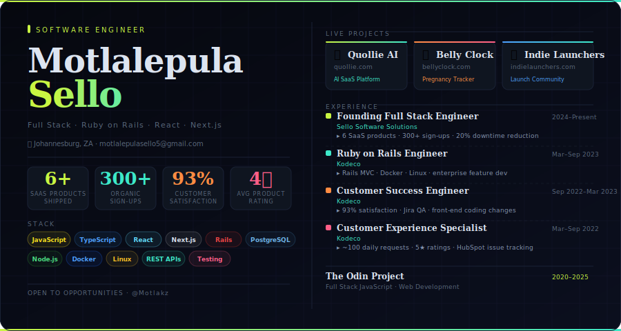

 

I build tools people appreciate. Six shipped SaaS products, 500+ sign-ups, a 4★ average - and I'm just getting started.

Ruby on the server. JavaScript everywhere else. Rails for reliability, Next.js for reach.

---

### ◈ &nbsp;Quollie AI &nbsp;—&nbsp; [quollie.com](https://quollie.com)
Your SEO traffic to booked appointments to paying customers - your sales automation engine does it all.

### ◉ &nbsp;Belly Clock &nbsp;—&nbsp; [bellyclock.com](https://bellyclock.com)
Fasting routine tracker for biohackers, health enthusiasts, and religious folks. Hourly progress, hydration reminders, and a timeline that makes the journey feel less overwhelming.

### ▶ &nbsp;Indie Launchers &nbsp;—&nbsp; [indielaunchers.com](https://indielaunchers.com)
A community and toolkit for indie makers going to market. Launch checklists, peer accountability, and visibility tools - for builders who ship without a team behind them.

---

`JavaScript` `TypeScript` `React` `Next.js` `Node.js` `Ruby on Rails` `PostgreSQL` `Docker` `Linux` `REST APIs`

---

📍 Johannesburg &nbsp;·&nbsp; ✉️ motlalepulasello5@gmail.com &nbsp;·&nbsp; open to collaborations & freelance
